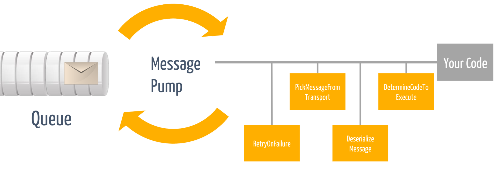

# Beyond simple benchmarks—A practical guide to optimizing code with BenchmarkDotNet

It is vital for code executed at scale to perform well. It is crucial to ensure performance optimizations actually make the code faster. Luckily, we have powerful tools which help—BenchmarkDotNet is a .NET library for benchmarking optimizations, with plenty of simple examples to help get started.

In most systems, the code we need to optimize is rarely simple. It contains assumptions we need to discover before we even know what to improve. The code is hard to isolate. It has dependencies, which may or may not be relevant to optimization. And even when we've decided what to optimize, it's hard to reliably benchmark the before and after. Only measurement can tell us if our changes actually make things faster. Without them, we could even make things slower, without even realizing.

Understanding how to create benchmarks is the tip of the iceberg. In this talk, you'll also learn how to identify what to change, how to isolate code for benchmarking, and more. You'll leave with a toolkit of succinct techniques and the confidence to go ahead and optimize your code. 

## Brainstorming

- how to make performance optimization actionable
- putting a practical process in-place to isolate components, measure + change + measure again, without breaking current behavior. Rinse and repeat
- combine that with something like a macro benchmark to see how the small changes can all add up to real-world improvements for users
- What parameters have an impact on what I want to benchmark
- What are reasonable values for those parameters that make we reasonably certain I have a good comparison baseline without unnecessarily exploding the runtime of the benchmark
- Can I do a series of quick runs to get a feel of the direction I'm heading vs when are longer runs important
- Optimize existing things until you hit the point of diminishing return. Exploring those limits makes you learn a ton about potential improvements for a new design
- Starting with an NSB endpoint and explore factors that are in place that have an impact on the throughput. Iterate through all aspects of the stack.
- Present a few best practices of benchmarking while talking about these concrete examples
- How do I avoid getting too much into profilers?

## Introduction

I remember the first time I started benchmarking my code changes to verify whether the things I though might accelerate this code really made an impact. I had already seen quite a few Benchmarks written with Benchmark.NET and felt quite certain it wouldn't take long. Oh, I was wrong. I mean, writing the skeleton of the benchmark was indeed simple. The mind-boggling part was trying to figure out what should be taken into the benchmark, how to isolate the code without a crazy amount of refactoring, what should be deliberately cut away to make sure the changes envisioned are going in the right direction and how to measure, change, and measure without burning away the allotted budget. But why even bother and go through all this hassle?

For code that is executed at scale, the overall throughput and memory characteristics are important. Code that spends unnecessary CPU or memory cycles ends up eating away resources that could be used to serve requests. With modern cloud native approaches, scalable code is even more important than before because often times we are getting billed by the number of resources consumed. The more efficient the code is, the smaller the bill or the more requests we can execute for the same amount of money.

In this talk, I have summarized my personal lessons of how to make performance optimizations actionable. I will show you a practical process to identify some common bottlenecks, isolate components and measure + change + measure without breaking current behavior. Let's not waste more time and get to the essence of this talk

## The performance loop

For me one of the key principles I try to apply to almost everything in software is making explicit tradeoffs and decisions while we go. This also applies to performance. A reasonably mature team should be "performance aware". My friend Maarten Balliauw once famously said, in some countries you have to be bear aware because for example when you are hiking in Canada it is good to be prepared for the likelihood of a bear crossing your hiking paths, not so much in Switzerland though ;) I digress...

When it comes to be performance, when you are performance aware, it doesn't mean you have to always go all the way in. Not at all. In fact, I always start with the simplest solutions that just works first and get some reasonably well test coverage in place. Once I have a working solution with good coverage, I start asking myself questions like:

- How is this code going to be executed at scale and what would the memory characteristics be (gut feeling)
- Are there simple low-hanging fruits I can apply to accelerate this code?
- Are there things I can move away from the hot path by simply restructuring a bit my code?
- What part is under my control and what isn't really?
- What optimizations can I apply, and when should I stop?

I have covered some of these nuances in further in my talk "Performance Tricks I learned from contributing to the Azure .NET SDK.". Once I have some better understanding of the context of the code, depending on the outcome, I start applying the following performance loop.

- Write a simple "sample" or harness that makes it possible to observe the component under inspection with a memory profiler and/or a performance profiler. The profiler snapshots give me an indication of the different subsystems at play to make an explicit decision on what to focus and what to ignore.
- Then I select the hot path, for example, responsible for the majority of allocations or the biggest slowdown (or where I feel I can make a first good enough impact without sinking days and weeks into it). If the code path in question is not well covered, I try to get some tests in place to make sure my tweaks will not break the existing assumptions / behavior => it doesn't help when something is superfast but utterly wrong :)
- Then I experiment with the changes I have in mind and check whether they pass the tests. Once it functionally works, I put things into a performance harness
- To save time, I extract the code as good as possible into a dedicated repository and do a series of "short runs" to see if I'm heading into the right direction. Once I'm reasonably happy with the outcome, I do a full job run to verify the before and after.
- Then I ship this code and focus my attention to other parts

But enough of the overview of the process. Let's dive into a practical example.

## NServiceBus Pipeline

NServiceBus is the heart of a distributed system and the Particular Service Platform. It helps create systems that are scalable, reliable, and flexible. At its core, NServiceBus works by routing messages between endpoints. Messages are plain C# classes that contain meaningful data for the business process that is being modeled. Endpoints can be running in different processes, on different machines, even at different times. NServiceBus makes sure that each message reaches its intended destination and is processed. NServiceBus accomplishes this by providing an abstraction over existing queuing technologies. While it's possible to work directly with queuing systems, NServiceBus provides extra features to make applications more reliable and scalable.

The most critical infrastructure piece inside an NServiceBus endpoint is the NServiceBus pipeline. The pipeline is the engine that makes sure all the required steps involved (serialization, deserialization, transactions, data access...) in sending or receiving messages are executed as efficiently as possible. As such it is crucial for the pipeline to not be in the way of our customers code.

### Profiling the pipeline

TBD

- NServiceBus with Azure Service Bus and a saga
- Talk about all the moving parts involved such as transport in/out, DI container, serializer, persistence, pipeline, logging, tracing...
- Zoom in into the pipeline because it is the centerpiece that keeps things together
- [First iteration](https://github.com/Particular/NServiceBus/pull/4125)
- [Second iteration](https://github.com/Particular/NServiceBus/pull/6237)
- [Third iteration](https://github.com/Particular/NServiceBus/pull/6394)
- Show how to profile the pipeline?

## Benchmark Pipeline (First iteration)

- Explain isolation of the various moving pieces
- Talk a bit about the before and after pattern
- Talk about the cycle of improve, measure, improve
- Various settings like ShortRuns, DryRuns and some best practices

## Benchmark Pipeline (Second iteration)

- Show how we can iteratively improve things with this approach

## Talk about getting lower on the stack

- Transport Azure Service Bus
- AMQP
- Show how we can do various micro optimization that have a compounding effect until we reach the point of redesigning (example body refactoring)

## Azure Service Bus SDK

- Show some of the body optimization benchmarks (example https://github.com/danielmarbach/MicroBenchmarks/tree/master/MicroBenchmarks/ServiceBus) and the high level view shown in https://github.com/Azure/azure-sdk-for-net/pull/19996#issuecomment-812663407

## AMQP Level

- If possible to down to that level to talk about encoding optimizations (see https://github.com/danielmarbach/azure-amqp-benchmarks)

## Recap

- Recap the process of "putting a practical process in-place to isolate components, measure + change + measure again, without breaking current behavior. Rinse and repeat"
- Recap some of the Benchmark.NET rules but point for more information to the microbenchmark design guidelines

## Interesting further reading material

- [Intro to Benchmark.net - How To Benchmark C# Code](https://www.youtube.com/watch?v=mmza9x3QxYE)
- [Getting started with dotMemory](https://www.youtube.com/watch?v=6Tmcx6cTExg)
- [How to profile .NET Core applications with dotTrace](https://www.youtube.com/watch?v=ZWS156lKAos)
- [Performance Profiling with Visual Studio](https://www.youtube.com/watch?v=FpibK0PKfcI&list=PLReL099Y5nRf2cOurn1hI-gSRxsdbC27C)
- [Microbenchmark Design Guidelines](https://github.com/dotnet/performance/blob/main/docs/microbenchmark-design-guidelines.md)
