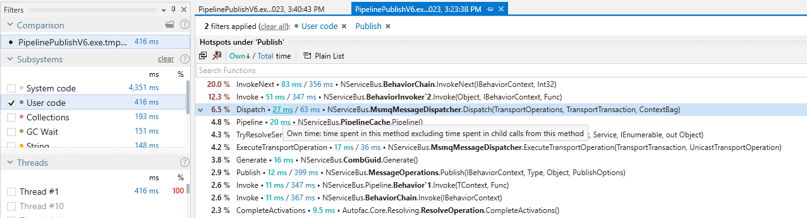
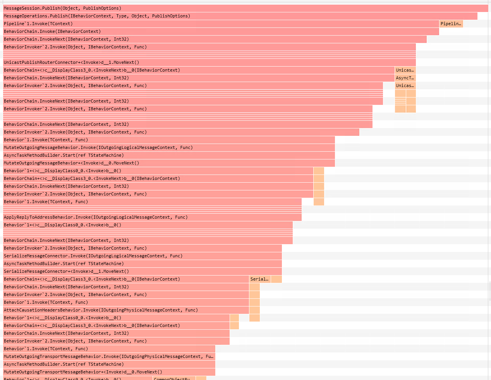
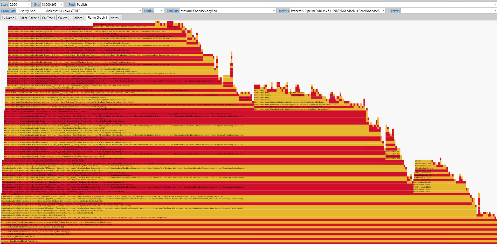
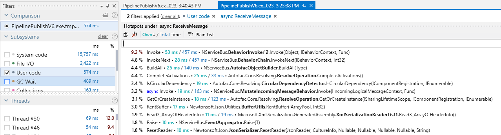
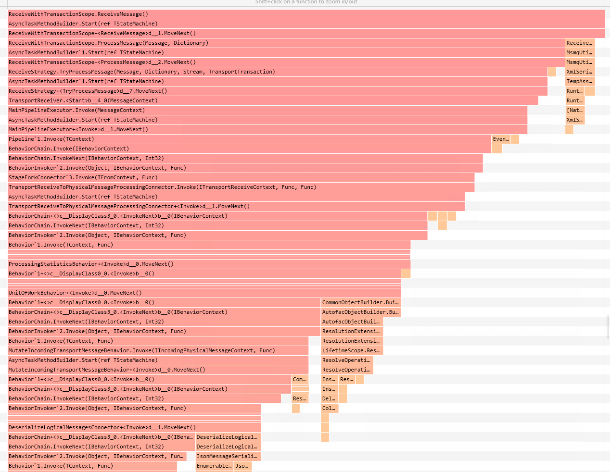
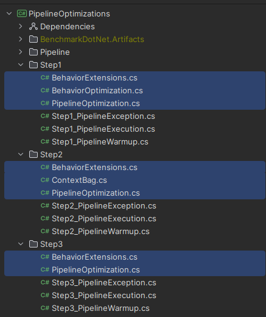
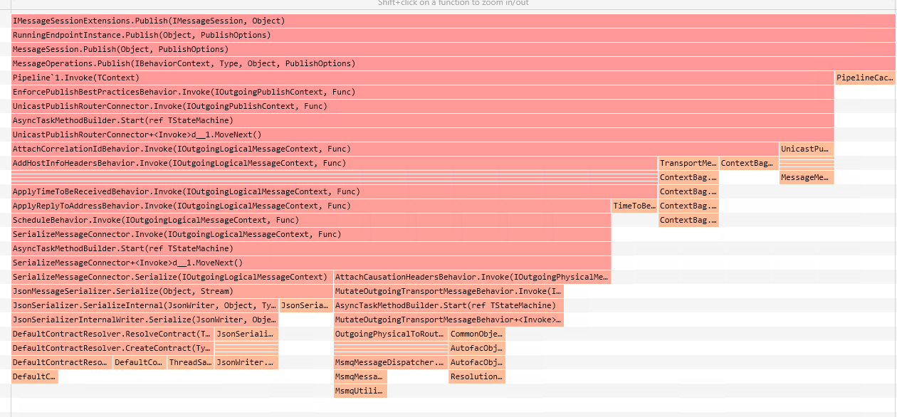
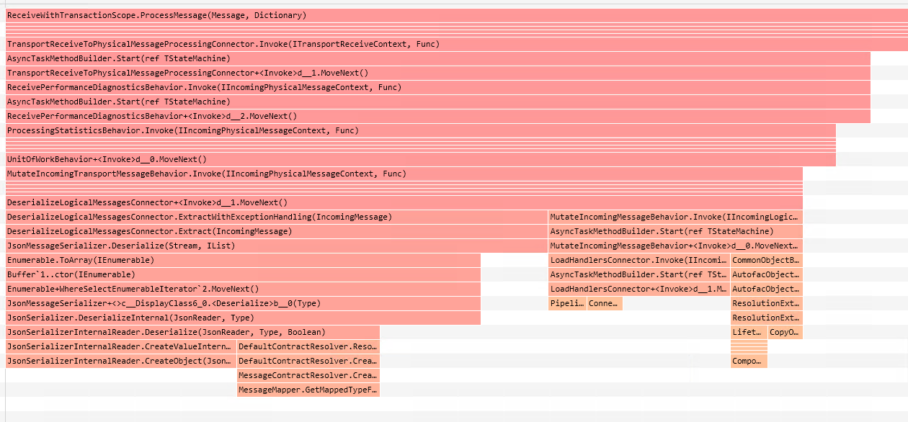
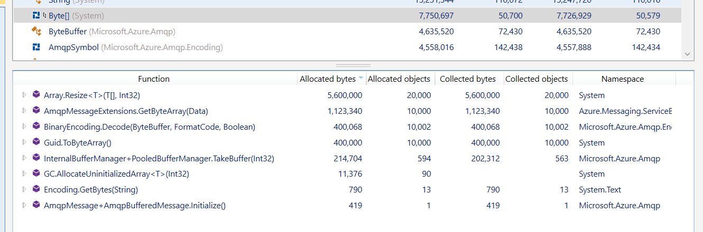
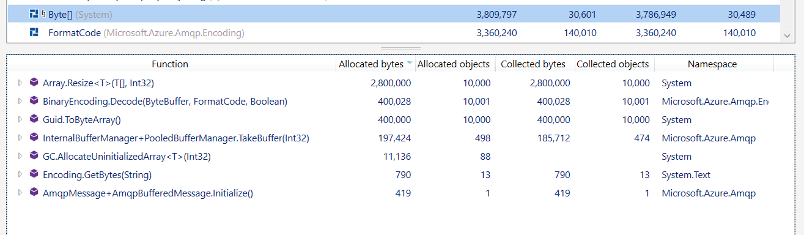

# Beyond simple benchmarks — A practical guide to optimizing code with BenchmarkDotNet

Alternative Title: Beyond simple benchmarks — A practical guide to optimizing code

It is vital for code executed at scale to perform well. It is crucial to ensure performance optimizations actually make the code faster. Luckily, we have powerful tools which help—BenchmarkDotNet is a .NET library for benchmarking optimizations, with plenty of simple examples to help get started.

In most systems, the code we need to optimize is rarely simple. It contains assumptions we need to discover before we even know what to improve. The code is hard to isolate. It has dependencies, which may or may not be relevant to optimization. And even when we've decided what to optimize, it's hard to reliably benchmark the before and after. Only measurement can tell us if our changes actually make things faster. Without them, we could even make things slower, without even realizing.

Understanding how to create benchmarks is the tip of the iceberg. In this talk, you'll also learn how to identify what to change, how to isolate code for benchmarking, and more. You'll leave with a toolkit of succinct techniques and the confidence to go ahead and optimize your code.

- [Slides Online](https://danielmarbach.github.io/BeyondSimpleBenchmarks)
- [Slides PDF](slides.pdf)

## Introduction

I remember the first time I started benchmarking my code changes to verify whether the things I thought might accelerate this code really made an impact. I had already seen quite a few Benchmarks similar to the one below written with Benchmark.NET and felt quite certain it wouldn't take long. 

```csharp
[SimpleJob]
[MemoryDiagnoser]
public class StringJoinBenchmarks {

  [Benchmark]
  public string StringJoin() {
    return string.Join(", ", Enumerable.Range(0, 10).Select(i => i.ToString()));
  }

  [Benchmark]
  public string StringBuilder() {
    var sb = new StringBuilder();
    for (int i = 0; i < 10; i++)
    {
        sb.Append(i);
        sb.Append(", ");
    }

    return sb.ToString(0, sb.Length - 2);
  }

  [Benchmark]
  public string ValueStringBuilder() {
    var seperator = new ReadOnlySpan<char>(new char[] { ',', ' '});
    using var sb = new ValueStringBuilder(stackalloc char[30]);
    for (int i = 0; i < 10; i++)
    {
        sb.Append(i);
        sb.Append(seperator);
    }

    return sb.AsSpan(0, sb.Length - 2).ToString();
  }
}
```

Oh, I was wrong. I mean, writing the skeleton of the benchmark was indeed simple. The mind-boggling part was trying to figure out what should be taken into the benchmark, how to isolate the code without a crazy amount of refactoring, what should be deliberately cut away to make sure the changes envisioned are going in the right direction, and how to measure, change, and measure without burning away the allotted budget. But why even bother and go through all this hassle?

For code that is executed at scale, the overall throughput and memory characteristics are important. Code that wastes unnecessary CPU or memory cycles ends up eating away resources that could be used to serve requests. With modern cloud-native approaches, scalable code is even more important than before because we are often billed by the number of resources consumed. The more efficient the code is, the smaller the bill, or the more requests we can execute for the same amount of money. And let's not forget more efficient code execution also means we are consuming less energy which is an important cornerstone for GreenIT too.

> We were able to see Azure Compute cost reduction of up to 50% per month, on average we observed 24% monthly cost reduction after migrating to .NET 6. The reduction in cores reduced Azure spend by 24%. [Microsoft Teams’ Infrastructure and Azure Communication Services’ Journey to .NET 6](https://devblogs.microsoft.com/dotnet/microsoft-teams-infrastructure-and-azure-communication-services-journey-to-dotnet-6/)

In this talk, I have summarized my personal lessons on how to make performance optimizations actionable. I will show you a practical process to identify some common bottlenecks, isolate components, and measure + change + measure without breaking current behavior. Let's not waste more time and get to the essence of this talk.

## The performance loop

For me one of the key principles I try to apply to almost everything in software is making explicit tradeoffs and decisions as we go. This also applies to performance. A reasonably mature team should be "performance aware". My friend Maarten Balliauw once famously said, in some countries you have to be bear aware because for example, when you are hiking in Canada it is good to be prepared for the likelihood of a bear crossing your hiking paths, not so much in Switzerland though ;) I digress...

When it comes to performance, when you are performance aware, it doesn't mean you have to always go all the way in. Not at all. In fact, I always start with the simplest solutions that just work first and get some reasonably good test coverage in place. Once I have a working solution with good coverage, I start asking myself questions like:

- How is this code going to be executed at scale, and what would the memory characteristics be (gut feeling)
- Are there simple low-hanging fruits I can apply to accelerate this code?
- Are there things I can move away from the hot path by simply restructuring a bit my code?
- What part is under my control and what isn't really?
- What optimizations can I apply, and when should I stop?

I have covered some of these nuances further in my talk "Performance Tricks I learned from contributing to the Azure .NET SDK.". Once I have a better understanding of the context of the code, depending on the outcome, I start applying the following performance loop.

- Write a simple "sample" or harness that makes it possible to observe the component under inspection with a memory profiler and a performance profiler. The profiler snapshots and flamegraphs give me an indication of the different subsystems at play, allowing me to make an explicit decision on what to focus on and what to ignore.
- Then I select the hot path, for example, the one responsible for the majority of allocations or the biggest slowdown (or where I feel I can make a good enough impact without sinking days and weeks into it). If the code path in question is not well covered, I try to get some tests in place to make sure my tweaks will not break the existing assumptions / behavior => it doesn't help when something is superfast but utterly wrong :)
- Then I experiment with the changes I have in mind and check whether they pass the tests. Once it functionally works, I put things into a performance harness
- To save time, I extract the code as well as possible into a dedicated repository and do a series of "short runs" to see if I'm heading in the right direction. Once I'm reasonably happy with the outcome, I do a full job run to verify the before and after.
- Then I ship this code and focus my attention on other parts

But enough of the overview of the process. Let's dive into a practical example.

## NServiceBus Pipeline


NServiceBus is the heart of a distributed system and the Particular Service Platform. It helps create systems that are scalable, reliable, and flexible. At its core, NServiceBus works by routing messages between endpoints. Messages are plain C# classes that contain meaningful data for the business process that is being modeled. Endpoints can be running in different processes on different machines, even at different times. NServiceBus makes sure that each message reaches its intended destination and is processed. NServiceBus accomplishes this by providing an abstraction over existing queuing technologies. While it's possible to work directly with queuing systems, NServiceBus provides extra features to make applications more reliable and scalable.

The most critical infrastructure piece inside an NServiceBus endpoint is the NServiceBus pipeline. The pipeline is the engine that makes sure all the required steps involved (serialization, deserialization, transactions, data access...) in sending or receiving messages are executed as efficiently as possible. As such, it is crucial for the pipeline to not get in the way of our customers' code.


This is conceptually very similar to the ASP.NET Core middleware


or expressed in code

```csharp
app.Use(async (context, next) => {
    // Do work that can write to the Response.
    await next();
    // Do logging or other work that doesn't write to the Response.
});
```

or as classes

```csharp
public class RequestCultureMiddleware {
    private readonly RequestDelegate _next;

    public RequestCultureMiddleware(RequestDelegate next) {
        _next = next;
    }

    public async Task InvokeAsync(HttpContext context) {
        // Do work that does something before
        await _next(context);
        // Do work that does something after
    }
}
```

in NServiceBus those pipeline / middleware elements are called behaviors and look like the following

```csharp
public class Behavior : Behavior<IIncomingLogicalMessageContext> {
    public override Task Invoke(IIncomingLogicalMessageContext context, Func<Task> next)
    {
        // Do work that does something before
        await next();
        // Do work that does something after
    }
}
```

During the pipeline execution, there is a lot that is actually going on. For example, for an incoming message, the transport (e.g. Azure Service Bus, SQS, MSMQ...) pushes the raw data of messages to the pipeline. The pipeline will deserialize the payload. Based on the message type, it might resolve infrastructure such as message handlers from the dependency injection container and load data from the persistence selected by the user (e.g CosmosDB, SQL Server, DynamoDB...). There are bits and pieces that create OpenTelemetry traces, logs and much more. In essence, we have to somehow focus on parts that are relevant to us within the context we are optimizing for. We can achieve that by profiling.

### Profiling the pipeline

To get a good overview of the problem domain in front of us, it is vital to create a sample or harness that allows us to zoom in on the problem space. Since my goal is to optimize the pipeline invocation, I can look at the pipeline invocation with a tool like DotTrace from Jetbrains to get a good understanding of the performance bottlenecks and analyze the memory usage with a tool like DotMemory. It is always recommended to look at multiple aspects such as memory, CPU, IO involvement and more to get insights from multiple angles

Below is an excerpt of such a harness. The harness sets up NServiceBus with a transport, a serializer and an InMemory persistence (to avoid unnecessary overhead that is currently not our focus). The harness has various points where I can take a snapshot to understand the memory characteristics of what's happening. In general, such a harness should adhere to the following guidelines:

- Compiled and executed under Release mode
- The harness should run for at least a few seconds and keep the overhead as small as possible to make sure it does not dominate the profile.
- It's recommended to disable Tiered JIT (`<TieredCompilation>false</TieredCompilation>`) (to avoid the need of warm up) and emit full symbols (`<DebugType>pdbonly</DebugType` and `<DebugSymbols>true</DebugSymbols>`) (not enabled by default for Release builds)


For example, it publishes 1000 events in parallel, which are then received by a handler that does nothing.

```csharp
var endpointConfiguration = new EndpointConfiguration("PublishSample");
endpointConfiguration.UseSerialization<JsonSerializer>();
var transport = endpointConfiguration.UseTransport<MsmqTransport>();
transport.Routing().RegisterPublisher(typeof(MyEvent), "PublishSample");
endpointConfiguration.UsePersistence<InMemoryPersistence>();
endpointConfiguration.EnableInstallers();
endpointConfiguration.SendFailedMessagesTo("error");

var endpointInstance = await Endpoint.Start(endpointConfiguration);

Console.WriteLine("Attach the profiler and hit <enter>.");
Console.ReadLine();

var tasks = new List<Task>(1000);
for (int i = 0; i < 1000; i++)
{
    tasks.Add(endpointInstance.Publish(new MyEvent()));
}
await Task.WhenAll(tasks);

Console.WriteLine("Publish 1000 done. Get a snapshot");
Console.ReadLine();
```

The handler code:

```csharp
public class MyEventHandler : IHandleMessages<MyEvent>
{
    public Task Handle(MyEvent message, IMessageHandlerContext context)
    {
        Console.WriteLine("Event received");
        return Task.CompletedTask;
    }
}
```

Let's take a look at the memory pressure of the publish operations.


To understand the data presented in front of us, we require domain knowledge of the problem at hand. That knowledge helps to navigate through the maze of noise we might see. As we can see, there are numerous `byte[]`, `MemoryStream` and `StreamWriter` allocations that are quite "hefty".

Before we jump to conclusions, let's take a look at the receiving end. That's when the messages invoke the handler we saw previously.


Lots of `byte[]`, `XmlTextReaderNodes` and Message extensions allocations.


The stack trace is also massive, containing plenty of steps that clearly hide the actual pipeline operations like `MutateIncomingTransportMessageBehavior` or `UnitOfWorkBehavior`.

So, should we try to optimize those away? Well, ideally, yes, but in this specific case, there are a few things we have to take into account:

- The allocations are mostly coming from the MSMQ transport which has a diminishing user base. Most users eventually transition away from MSMQ to either SQL Server, RabbitMQ or a cloud transport like Azure Service Bus or Amazon SQS. Our efforts there might lead to allocation reductions only for a very limited segment of users.
- Another angle could be that we might not be transport experts. We already know that by making iterative gains on this hot path, we will end up with great improvements. But since every activity has to be weighted against building features and all the other activities, it might not be justifiable right now to ramp up knowledge in that area.
- Finally, our goal is to see what we can do to optimize the pipeline. The pipeline optimizations have great benefits for all users, independent of the transports.

When we look at an individual invocation (called `Behavior`) we see the following picture:


So let's focus on the `Behavior`, `BehaviorChain`, `Func<Task>`, `Func<IBehaviorContext, Task>` and `__DisplayClass**` allocations since they are coming from the pipeline invocation. Luckily, dotMemory also allows us to filter by namespace to get a better overview.


Let's take a look at the CPU characteristics of the publish operations.



Each call is shown as a horizontal bar whose length depends on the call’s total time, which equals the function’s own time + the time of all its child functions. The longer the call, the longer the bar. The coolest thing about the flame graph is that you don’t need to thoroughly analyze the time of each call, as you immediately see it on the graph.



by the way if you prefer using "free tools" and you are running in Windows I can highly recommended using PerfView which gives you similar results and in more recent versions also allows zooming into the flamegraph.



We can see that the `BehaviorChain` is consuming 20% and the `BehaviorInvoker` 12.3% of the CPU which is a third of the overall time spent executing the mechanisms of the pipeline.

On the receive end it is slightly less dramatic but there is still a measurable impact.



We can see that the `BehaviorChain` is consuming 4.8% and the `BehaviorInvoker` 9.2% of the CPU which is a seventh of the overall the time spent executing the mechanisms of the pipeline.



## Testing the pipeline

Luckily, there were existing acceptance tests in place. Those acceptance tests are executing whole NServiceBus scenarios end-to-end. So, if anything breaks while modifying the pipeline, it should be immediately captured by those tests. At the time, I added a few additional tests that I wouldn't call it Unit Test but more of a component test that verifies more than just a single class.


## Improving the pipeline

Before I even started benchmarking the changes and trying to compare it , I started making some improvements to the code that are not really relevant for this talk. In case you are interested in what I did, you can read these blog posts on the particular blog:

- [10X faster execution with compiled expression trees](https://particular.net/blog/10x-faster-execution-with-compiled-expression-trees)
- [How we achieved 5X faster pipeline execution by removing closure allocations](https://particular.net/blog/pipeline-and-closure-allocations)

In essence, I applied a bunch of memory allocation optimization tricks that removed all of the `Behavior`, `BehaviorChain`, `Func<Task>`, `Func<IBehaviorContext, Task>` and `__DisplayClass**` allocations mentioned previously.

## Benchmarking the pipeline

If you are lucky, the thing you want to benchmark might be a public method on some helper or utility without countless external dependencies. Then it is mostly simple because you can either have a benchmark project in the solution, reference the assembly in question, and start calling the method. In the worst case, you might need to add `InternalsVisibleTo` to give the benchmark project access to that helper or utility. So much for the theory. In practice, software is way messier than we like to admit. Components sometimes come with numerous dependencies. So, we can bite the bullet and just throw them all under a benchmark but then the gains you are trying to compare might get lost in the signal-to-noise ratio.

When I first faced this problem, I started looking for various approaches and ended up with a pragmatic but potentially slightly controversial one. The pragmatic approach I took was copy-pasting the existing relevant pipeline components and adjusting the source code to the bare essentials. This allows me to isolate the compoment under inspection and make sure for the things I want to verify and experiment with I have always a controllable environment that is only progressing when I adjust the copy pasted sources by copying over new changes. What's also possible is that I can tweak that code with for example partial classes to be able to easily overload relevant aspects I'm tweaking and then execute different approaches against each other to make sure I select that one with the right tradeoffs.

I want to highlight that this approach worked well for me, and I think there is great value in it for others too, but as always, every approach comes with tradeoffs. Towards the end of the talk, I'm also going to do an outlook on preventing regressions in code, where I highlight another approach as an alternative. That being said I would say apply the 80/20 rule. For code that is not changing that often the approach shown here works really well and gets you started tipping your toes into becoming performance aware quite quickly without overwhelming the whole organization. Remember a culture change takes time and you rather want to make changes gradually.

For example, since the pipeline is quite composable, I can remove all existing behaviors and just have relevant behaviors in my test harness. Furthermore, the dependency injection container can be replaced with hard-coded assumptions by simply newing up relevant classes where needed. Actual IO-Operations have been replaced by simply returning completed tasks since those IO-operations are known to be hundreds or a thousand times slower anyway, and our goal is to remove all obstacles in the way of pipeline execution before even doing IO-Operations. Without going into many more details about the mechanics of the pipeline, here is what the folder structure looks like:


When writing Unit Tests, we ideally want to test all methods and properties of the given type. We also test both the happy and unhappy paths. The result of every Unit Test run is a single value: passed or failed.

Benchmarks are different. First and foremost, the result of a benchmark run is never a single value. It's a whole distribution, described with values like mean, standard deviation, min, max and so on. To get a meaningful distribution, the benchmark has to be executed many, many times. This takes a lot of time. The goal of benchmarking is to test the performance of all the methods that are frequently used (hot paths) and should be performant. The focus should be on the most common use cases, not edge cases.

How do we find those hot paths and the most common use cases?

Let's take a look at the benchmark.

```csharp
[ShortRunJob]
[MemoryDiagnoser]
public class PipelineExecution {

    [Params(10, 20, 40)]
    public int PipelineDepth { get; set; }


    [GlobalSetup]
    public void SetUp()  {
        behaviorContext = new BehaviorContext();

        pipelineModificationsBeforeOptimizations = new PipelineModifications();
        for (int i = 0; i < PipelineDepth; i++)
        {
            pipelineModificationsBeforeOptimizations.Additions.Add(RegisterStep.Create(i.ToString(),
                typeof(BaseLineBehavior), i.ToString(), b => new BaseLineBehavior()));
        }

        pipelineModificationsAfterOptimizations = new PipelineModifications();
        for (int i = 0; i < PipelineDepth; i++)
        {
            pipelineModificationsAfterOptimizations.Additions.Add(RegisterStep.Create(i.ToString(),
                typeof(BehaviorOptimization), i.ToString(), b => new BehaviorOptimization()));
        }

        pipelineBeforeOptimizations = new BaseLinePipeline<IBehaviorContext>(null, new SettingsHolder(),
            pipelineModificationsBeforeOptimizations);
        pipelineAfterOptimizations = new PipelineOptimization<IBehaviorContext>(null, new SettingsHolder(),
            pipelineModificationsAfterOptimizations);
    }

    [Benchmark(Baseline = true)]
    public async Task Before() {
        await pipelineBeforeOptimizations.Invoke(behaviorContext);
    }

    [Benchmark]
    public async Task After() {
        await pipelineAfterOptimizations.Invoke(behaviorContext);
    }
}
```

For the pipeline we have already mentioned, we want to verify the raw pipeline execution throughput. So, that is one of the scenarios we have encapsulated here in this benchmark. 

The above benchmark sets up the infrastructure part in the `[GlobalSetup]` (*) which makes sure the method marked with the attribute will be executed exactly once before running the benchmark for the first time. It is important to do it in the global setup because we are not interested in measuring the setup time of the pipeline yet.

The next question is what influences the pipeline execution throughput. What is known is that the pipeline can be dynamically extended "in-depth" by adding more behavior. So coming up with reasonable pipeline depths would be a good permutation for the pipeline execution benchmark. The `PipelineDepth` property does exactly that. Be aware of the potential combinatorial explosion when introducing more parameters to a benchmarks.

To get a good feeling of where we are heading, I configured the benchmark to do a `ShortRun`. This is done because regular job runs can take a lot of time and during the mode where I'm still iterating over the approaches I'm just interested in seeing whether I'm going into the right direction vs having more statistically relevent results.

### Benchmark Best practices

- The benchmarks should follow the Single Responsibility Principle as other methods do. It means that a single benchmark should do a single thing.
- A benchmark should have no side effects. For example, adding values to an existing field means the list is growing with every benchmark invocation.
- To prevent dead code elimination, BenchmarkDotNet consumes the result returned from a benchmark and writes it to a volatile field. Alternatively, use the [Consumer](https://github.com/dotnet/BenchmarkDotNet/blob/master/src/BenchmarkDotNet/Engines/Consumer.cs) directly.
- BenchmarkDotNet does not require the user to provide the number of invocations per iteration. This value is determined by BenchmarkDotNet during the Pilot Experiment Stage, based on the IterationTime setting
- Be explicit. C# language features like implicit casting and var allow us to introduce invisible side effects to the benchmarks.
- Avoid running any resource-heavy processes that could spoil the benchmark results while running the benchmarks


(*) If your benchmark requires a clean state for every invocation, you need to use the `[IterationSetup]` attribute. Unfortunately, just using the `[IterationSetup]` attribute is not enough to get stable results. You also need to make sure that the benchmark itself performs enough computations for a single invocation to run longer than 100ms. If you don't, your benchmark will be entirely invalid.

### Why Benchmark.NET

Benchmarking is really hard (especially microbenchmarking), you can easily make a mistake during performance measurements.
BenchmarkDotNet will protect you from the common pitfalls (even for experienced developers) because it does all the dirty work for you:

- BenchmarkDotNet does not require the user to provide the number of iterations and invocations per iteration, it implements a smart heuristic based on standard error and runs the benchmark until the results are stable.
- BenchmarkDotNet runs every benchmark in a separate process, process isolation allows for avoiding side effects. The more memory allocated by a given benchmark, the bigger the difference between in-proc vs out-proc execution.
- BenchmarkDotNet was designed to make accurate micro-benchmarks with repeatable results possible, to achieve that, it does many things, including overhead calculation and subtraction, warm up of the code, it consumes results to avoid dead code elimination.
- BenchmarkDotNet removes outliers by default

## More scenarios that are relevant

So far we only covered the execution throughput in relation to the pipeline depth. Another scenario that is relevant for the pipeline execution is that we need to measure how in behaves in warmup scenarios. For example depending on the approach we might need to cache some invocation pipelines at startup or at the point of the first invocation.

Benchmark.NET as previously mentioned already does warmups and statistical analysis so that during the execution tests we don't have to think about those scenarios. But if we want to compare how the warmup behavior gets better (or worse) it is required to do a dedicated benchmark.

TODO: Maybe leave this out because the added value could be questionable.

```csharp
[ShortRunJob]
[MemoryDiagnoser]
public class Step1_PipelineWarmup {
    // rest almost the same

    [Benchmark(Baseline = true)]
    public BaseLinePipeline<IBehaviorContext> Before() {
        var pipelineBeforeOptimizations = new BaseLinePipeline<IBehaviorContext>(null, new SettingsHolder(),
            pipelineModificationsBeforeOptimizations);
        return pipelineBeforeOptimizations;
    }

    [Benchmark]
    public PipelineOptimization<IBehaviorContext> After() {
        var pipelineAfterOptimizations = new PipelineOptimization<IBehaviorContext>(null, new SettingsHolder(),
            pipelineModificationsAfterOptimizations);
        return pipelineAfterOptimizations;
    }
}
```

Because of the design choice of doing the pipeline invocation caching as part of the constructor of the pipeline we need to execute the constructor under a benchmark. Because we want to avoid dead code elimination we simply return the constructed pipeline.

Most of the time it doesn't make sense to test the code path that throws. We would be measuring the performance of throwing and catching the exceptions. Throwing exceptions should be exceptional and exceptions should not be used to control flow. It's an edge case, we should focus on common use cases, not edge cases. But for the pipeline things are a bit different. In a message based system we are potentially receiving thousands of messages a second. If there is a programming error in the code that gets executed NServiceBus will go through a series of retries and eventually move the messages to the error queue for further processing later. When this happends lots and lots of exceptions are thrown plus the stack trace gets added as metadata to the message that is moved to the error queue. This allows visualizing the problem with tools (we can for example group by stack trace characteristics or exceptions) and then retry messages in groups once the programming error is resolved. Long story short the execution throughput in exception cases matters and we need to make sure the stacke trace contains only the necessary information. In essence, exception cases matter for the pipeline.

```csharp
[ShortRunJob]
[MemoryDiagnoser]
public class Step2_PipelineException {
    [GlobalSetup]
    public void SetUp() {
        behaviorContext = new BehaviorContext();

        pipelineModificationsBeforeOptimizations = new PipelineModifications();
        for (int i = 0; i < PipelineDepth; i++)
        {
            pipelineModificationsBeforeOptimizations.Additions.Add(RegisterStep.Create(i.ToString(),
                typeof(Step1.BehaviorOptimization), i.ToString(), b => new Step1.BehaviorOptimization()));
        }
        var stepdId = PipelineDepth + 1;
        pipelineModificationsBeforeOptimizations.Additions.Add(RegisterStep.Create(stepdId.ToString(), typeof(Throwing), "1", b => new Throwing()));

        pipelineModificationsAfterOptimizations = new PipelineModifications();
        for (int i = 0; i < PipelineDepth; i++)
        {
            pipelineModificationsAfterOptimizations.Additions.Add(RegisterStep.Create(i.ToString(),
                typeof(Step1.BehaviorOptimization), i.ToString(), b => new Step1.BehaviorOptimization()));
        }
        pipelineModificationsAfterOptimizations.Additions.Add(RegisterStep.Create(stepdId.ToString(), typeof(Throwing), "1", b => new Throwing()));

        pipelineBeforeOptimizations = new Step1.PipelineOptimization<IBehaviorContext>(null, new SettingsHolder(),
            pipelineModificationsBeforeOptimizations);
        pipelineAfterOptimizations = new PipelineOptimization<IBehaviorContext>(null, new SettingsHolder(),
            pipelineModificationsAfterOptimizations);
    }

    [Benchmark(Baseline = true)]
    public async Task Before() {
        try
        {
            await pipelineBeforeOptimizations.Invoke(behaviorContext).ConfigureAwait(false);
        }
        catch (InvalidOperationException)
        {
        }
    }

    [Benchmark]
    public async Task After() {
        try
        {
            await pipelineAfterOptimizations.Invoke(behaviorContext).ConfigureAwait(false);
        }
        catch (InvalidOperationException)
        {
        }
    }
    
    class Throwing : Behavior<IBehaviorContext> {
        public override Task Invoke(IBehaviorContext context, Func<Task> next)
        {
            throw new InvalidOperationException();
        }
    }
}
```

Maybe you have noticed the names Step1, Step2 and Step3. Because I've gone the extra mile of making relevant things "pluggable" with partial classes and methods it is possible to plug into the benchmark multiple versions of the code optimizations and compare them to each other. Note in the screenshot below how the different step folders contain partial classes that extend the previously shown "infrastructure" in the pipeline folder tweaked for the specific scenario being optimized.



If you are interested to learn more you can have a look at the repository I will share towards the end of my talk.

## Bringing it back to the harness

Let's take a look at the memory pressure of the publish operations.


The pressure of the receive operations.


Let's take a look on how we are doing in terms of CPU.





The flamegraphs clearly indicate how all the bloat that previously has eaten up 32.3% of the publish operations and 14% of the receive operations are all gone. That is a big win also from a CPU profiling perspective. Be careful to not overemphasize on the percentage improvements only. It is much more important to look at the CPU wall clock time improvements. I used percentage here to get a point across.

## Talk about getting lower on the stack


In the profiling the pipeline I have talked about the importance of the context that has to be taken into account when choosing an area to optimize. In that discussion we saw a lot of allocations being created by the queuing system MSMQ and about the leverage of effect of focusing on the pipeline accross the whole NServiceBus ecosystem.

While describing the performance optimization cycle I have also talked about how that is an iterative approach in which we gradually make changes and shift attention across the code base on the hot path. One way of doing this is by either go breadth first or depth first. At the end of the day it really depends on the code base, various hot paths involved which strategy is more effective. With the NServiceBus pipeline one of the key throughput leverage point besides the pipeline is the transport. So in that case it is possible to look at for example the customer distribution and then pick the transport that has the broadest set of customers. For us the Azure Service Bus has a broad customer range and therefore looking at ways to improve the NServiceBus integration with the Azure Service Bus transport has a great potential for leverage.


So going lower on the stack is what I've done here. In the interest of time I'm not going through the whole process again but show you the first steps that I find helpful even in cases where we might not entirely control the whole code base.


```csharp
await using var serviceBusClient = new ServiceBusClient(connectionString);

await using var sender = serviceBusClient.CreateSender(destination);
var messages = new List<ServiceBusMessage>(1000);
for (int i = 0; i < 1000; i++)
{
    messages.Add(new ServiceBusMessage(UTF8.GetBytes($"Deep Dive {i} Deep Dive {i} Deep Dive {i} Deep Dive {i} Deep Dive {i} Deep Dive {i}")));

    if (i % 100 == 0)
    {
        await sender.SendMessagesAsync(messages);
        messages.Clear();
    }
}

await sender.SendMessagesAsync(messages);

WriteLine("Messages sent");
Console.WriteLine("Take snapshot");
Console.ReadLine();

var countDownEvent = new CountdownEvent(1000);

var processorOptions = new ServiceBusProcessorOptions
{
    AutoCompleteMessages = true,
    MaxConcurrentCalls = 100,
    MaxAutoLockRenewalDuration = TimeSpan.FromMinutes(10),
    ReceiveMode = ServiceBusReceiveMode.PeekLock,
};

await using var receiver = serviceBusClient.CreateProcessor(destination, processorOptions);
receiver.ProcessMessageAsync += async messageEventArgs =>
{
    var message = messageEventArgs.Message;
    await Out.WriteLineAsync(
        $"Received message with '{message.MessageId}' and content '{UTF8.GetString(message.Body)}' / binary {message.Body}");
    countDownEvent.Signal();
};
// rest omitted
await receiver.StartProcessingAsync();

countDownEvent.Wait();

Console.WriteLine("Take snapshot");
Console.ReadLine();

await receiver.StopProcessingAsync();
```

The above test harness is a little bit more involved. But the gist is the same. The harness sends 1000 messages concurrently and then waits until they are all received. Within the handler code, the body is accessed multiple times (at the time of writing, I had a hunch accessing the body materializes the byte array on every access). This is how the memory profile looks like (here I'm just focusing on the memory profile, but of course you'd be doing CPU and IO profiles too ;) ):



The test harness showed quite a few other locations that could benefit from speed-ups that got resolved over multiple iterations of changes. If you want to hear more about some the changes done I suggest you watch "Performance Tricks I learned from contributing to the Azure .NET SDK.".

I'm a firm believer, it is helpful to push existing code to the limits before trying to redesign things. Only by pushing code to the limits we learn more about the boundary conditions of the code, and that knowledge is crucial input to find a good new design. With the body array allocations, the Azure Service Bus library had a bunch of scenarios that required a completely new way of handling the body in order to address the allocations. Previous iterations of adjusting the memory characteristics on the send and receive hot path though helped to shape the understanding and eventually lead to [great improvements in the current design](https://github.com/Azure/azure-sdk-for-net/pull/19996) (expressiveness, ease of understanding) and better memory characteristics.



This essentially kicked off the performance optimization loop on the "transport" layer. The test harness also made it possible to see layers even deeper down. For example the Azure Service Bus library using a library to manage the Advanced Message Queuing Protocol (AMQP) implementation. The library uses custom encoding mechanisms that created lots of allocations. Once the Azure Service Bus library reached a point of diminishing returns I started tweaking the encodings in the AMQP library.

The performance optimization loop can be applied on various layers of the stack iteratively. It is also possible to apply the loop in a broader context in several places before going deep on a giving call stack or do a combination of both depending on the use case.

## Preventing regressions

The goal here was to show an approach that has worked well for me for a long time, even before the tooling matured. Once you have established a performance culture, it would be possible to go even a step further. Preventing regressions is a fundamental part of a good performance culture. The cheapest regression is one that does not get into the product.

Thanks to the guidance in [Preventing Regressions](https://github.com/dotnet/performance/blob/main/docs/benchmarking-workflow-dotnet-runtime.md) and the [ResultComparer](https://github.com/dotnet/performance/blob/main/src/tools/ResultsComparer/README.md) tool, it is possible to execute benchmarks against the baseline version of the code, store the artifacts in a dedicated folder (example `before`), forward the repository history to the optimized versions, build in release mode, execute the same benchmark again, but this time store the results in another folder (example `after`) and then compare them.

```bash
C:\Projects\performance\src\tools\ResultsComparer> dotnet run --base "C:\results\before" --diff "C:\results\after" --threshold 2%
```

For regression testing it is crucial to have a stable build pipeline to execute the benchmarks against. Otherwise the results of these benchmarks cannot be trusted. Or to quote Andrey Akinshin, one of the authors of Benchmark.NET:

> Two subsequent builds on the same revision can have ranges of 1.5..2 seconds and 12..36 seconds. CPU-bound benchmarks are much more stable than Memory/Disk-bound benchmarks, but the “average” performance levels still can be up to three times different across builds.

> Based on this brief study, I do not recommend using the default GitHub Actions build agent pool for any kind of performance comparisons across multiple builds: such results can not be trusted in the general case. If you want to get a reliable set of performance tests, it’s better to have a dedicated pool of physical build agents with a unified hardware/software configuration using carefully prepared OS images.

[Performance stability of GitHub Actions](https://aakinshin.net/posts/github-actions-perf-stability/)

## Recap

- Recap the process of "putting a practical process in-place to isolate components, measure + change + measure again, without breaking current behavior. Rinse and repeat"
- Recap some of the Benchmark.NET rules but point for more information to the microbenchmark design guidelines
- putting a practical process in-place to isolate components, measure + change + measure again, without breaking current behavior. Rinse and repeat
- combine that with something like a macro benchmark to see how the small changes can all add up to real-world improvements for users
- What parameters have an impact on what I want to benchmark
- What are reasonable values for those parameters that make we reasonably certain I have a good comparison baseline without unnecessarily exploding the runtime of the benchmark
- Can I do a series of quick runs to get a feel of the direction I'm heading vs when are longer runs important
- Optimize existing things until you hit the point of diminishing return. Exploring those limits makes you learn a ton about potential improvements for a new design
- Framework vs business code performance testing. Although I'm showing the pipeline these things are also good for business code performance testing

## Interesting further reading material

- [Intro to Benchmark.net - How To Benchmark C# Code](https://www.youtube.com/watch?v=mmza9x3QxYE)
- [Getting started with dotMemory](https://www.youtube.com/watch?v=6Tmcx6cTExg)
- [How to profile .NET Core applications with dotTrace](https://www.youtube.com/watch?v=ZWS156lKAos)
- [Performance Profiling with Visual Studio](https://www.youtube.com/watch?v=FpibK0PKfcI&list=PLReL099Y5nRf2cOurn1hI-gSRxsdbC27C)
- [Microbenchmark Design Guidelines](https://github.com/dotnet/performance/blob/main/docs/microbenchmark-design-guidelines.md)
- Pipeline Optimizations
  - [First iteration](https://github.com/Particular/NServiceBus/pull/4125)
  - [Second iteration](https://github.com/Particular/NServiceBus/pull/6237)
  - [Third iteration](https://github.com/Particular/NServiceBus/pull/6394)
- [Performance stability of GitHub Actions](https://aakinshin.net/posts/github-actions-perf-stability/)
- [Sample performance investigation using BenchmarkDotNet and PerfView](https://adamsitnik.com/Sample-Perf-Investigation/)
- [Profiling .NET Code with PerfView and visualizing it with speedscope.app](https://adamsitnik.com/speedscope/)
- [Adam Sitnik - .NET Performance Investigation](https://www.youtube.com/watch?v=y4HV5m5GR7o)
